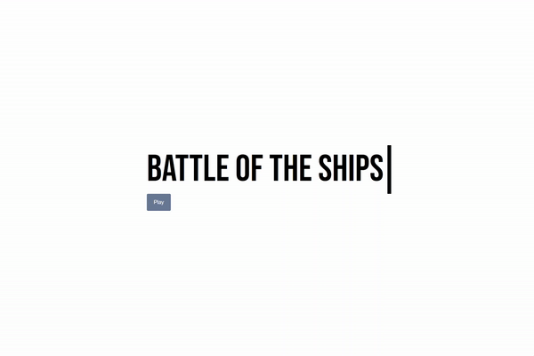
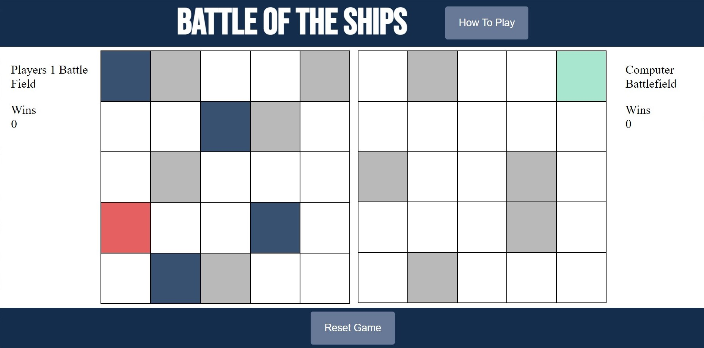

# Battle of the Ships

## Description  
  
This project recreates the classic game of Battleship. Javascript will power the logic of the game while using HTML/CSS for the visual elements. The *User* (Player 1) will be playing against the *Computer* (Player 2) on a 5x5 grid. Each player will be given 5 ships to place on the battlefield. The first player to sink their opponents battleship wins.

Project completion road map using [Trello](https://trello.com/b/z8ZkVMXn/unit-1-project)

Note: Battleships will have a size of 1x1. If we get a working prototype functioning, different ship sizes will be implemented.  

---

## Getting Started

Want to play the game? [Click Here!]()

Want to see what makes this game tick? 

- `Fork` and `Clone` the repository.
- Open the `script.js` file.

---

## How To Play

1. When the game loads, the player will will select where on their board they would like to place their 5 ships.
    - Note: Each ship must be on a different sqaure.
2. The computer will follow by placing their ships and displaying the board. 
3. Players will take turns sinking each other ship by slecting the opponents board.
    - If the user hits the computers ship, the square will turn green.
    - If the computer hits the users ship, the square will turn red.
4. The first to sink the opponents 5 ships wins the round. You can either *Play Agin* or *Reset Game*

---
## Credits

The game used resources in its implementation from the following sources:

- [Modal Intro](https://github.com/taubman33/modal_intro)

- [CSS Typewriter Effect](https://www.sitepoint.com/css-typewriter-effect/)

- [FreeSFX - Explosion and Orchestral Hit](https://www.freesfx.co.uk/sfx/explosion)